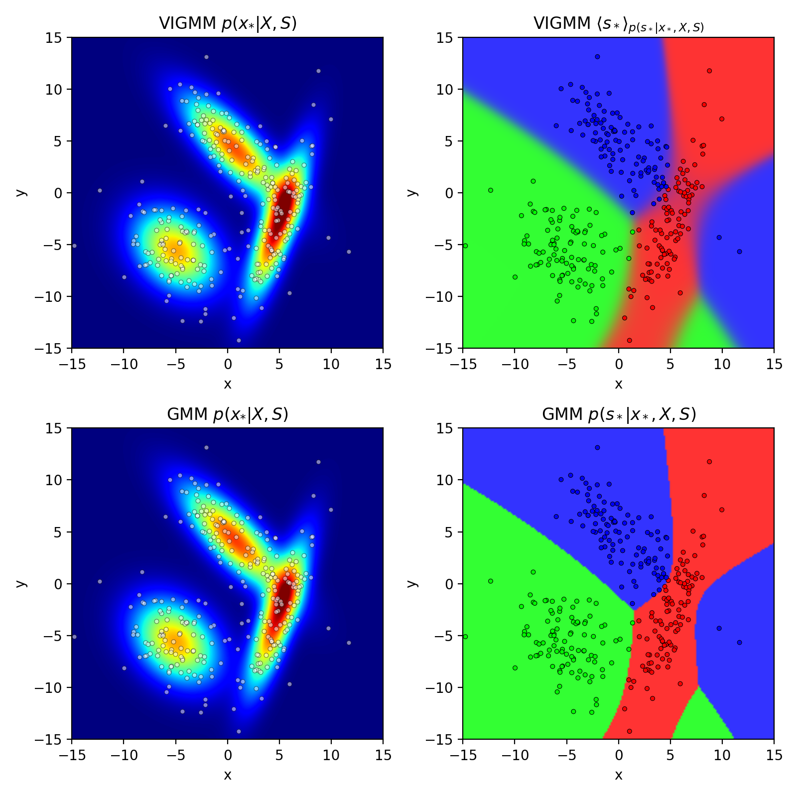

# Variational Inference GMM

「ベイズ推論による機械学習」（須山敦志著）の4章のガウス混合モデルを参考にした。事後分布の推論には変分推論を使った。予測分布とクラス予測平均の計算は詳しく記載されていなかったので、以下のように導出して実装した。

## 予測分布の導出

モデルの定義は書籍の4.4節を参照。導出は4.4.4節の崩壊型ギブスサンプリングを参考にした。

### 予測分布 $p(\bm{x}_* | \bm{X}, \bm{S})$ の導出

$$
    \begin{aligned}
        P(\bm{x}_* | \bm{X}, \bm{S}) &= \sum_{k=1}^K p(\bm{x}_*, s_{*,k}=1 | \bm{X}, \bm{S}) \\
            &= \sum_{k=1}^K p(\bm{x}_* | s_{*,k}=1, \bm{X}, \bm{S}) p(s_{*,k}=1 | \bm{X}, \bm{S}) \\
            &= \sum_{k=1}^K \mathrm{St}\Bigg(\bm{x}_* \Bigg| \bm{m}_k, \frac{(1 - D + \hat{\nu}_k)\hat{\beta}_k}{1 + \hat{\beta}_k} \hat{\bm{W}}_k, 1 - D + \hat{\nu}_k\Bigg) \mathrm{Cat}\Bigg(s_{*,k}=1 \Bigg| \Bigg(\frac{\hat{\bm{\alpha}}_k}{\sum_{i=1}^K\hat{\bm{\alpha}}_i}\Bigg)_{k=1}^K\Bigg) \\
            &= \sum_{k=1}^K \frac{\hat{\bm{\alpha}}_k}{\sum_{i=1}^K\hat{\bm{\alpha}}_i} \mathrm{St}\Bigg(\bm{x}_* \Bigg| \bm{m}_k, \frac{(1 - D + \hat{\nu}_k)\hat{\beta}_k}{1 + \hat{\beta}_k} \hat{\bm{W}}_k, 1 - D + \hat{\nu}_k\Bigg)
    \end{aligned}
$$

$$
\Bigg(\mathrm{s.t.}\quad \sum_{k=1}^K \frac{\hat{\bm{\alpha}}_k}{\sum_{i=1}^K\hat{\bm{\alpha}}_i} = 1 \Bigg)
$$

### クラス予測平均 $\langle \bm{s}_* \rangle_{p(\bm{s}_* | \bm{x}_*, \bm{X}, \bm{S})}$ の導出

$$
    \begin{aligned}
        \langle \bm{s}_* \rangle_{p(\bm{s}_* | \bm{x}_*, \bm{X}, \bm{S})} &= \sum_{k=1}^K \bm{e}_k p(s_{*,k}=1 | \bm{x}_*, \bm{X}, \bm{S}) \\
            &\propto \sum_{k=1}^K \bm{e}_k p(\bm{x}_* | s_{*, k}=1, \bm{X}, \bm{S}) p(s_{*,k}=1 | \bm{X}, \bm{S}) \\
            &= \Bigg( \frac{\hat{\bm{\alpha}}_k}{\sum_{i=1}^K\hat{\bm{\alpha}}_i} \mathrm{St}\Bigg(\bm{x}_* \Bigg| \bm{m}_k, \frac{(1 - D + \hat{\nu}_k)\hat{\beta}_k}{1 + \hat{\beta}_k} \hat{\bm{W}}_k, 1 - D + \hat{\nu}_k\Bigg) \Bigg)_{k=1}^K
    \end{aligned}
$$

$$
\Bigg(\mathrm{s.t.}\quad \sum_{k=1}^K \frac{\hat{\bm{\alpha}}_k}{\sum_{i=1}^K\hat{\bm{\alpha}}_i} = 1, \quad \sum_{k=1}^K \langle s_{*, k}\rangle=1 \Bigg)
$$

3行目の式を予測分布 $p(\bm{x}_* | \bm{X}, \bm{S})$ で割ることで正規化できる。

## 実行環境

* Python 3.7
* Numpy 1.17
* Scipy 1.3
* Matplotlib 3.1
* Scikit-Learn 0.21

## 実行結果

上がVIGMM、下が通常のGMM。観測データが単純なので左図の予測分布にはあまり違いはない。右図のクラス予測はクラスごとの予測値をRGB値にマッピングしている。VIGMMは $s_*$ がカテゴリカル分布に従う確率変数となるので期待値を求めることでクラス境界の曖昧さを表現できる。

